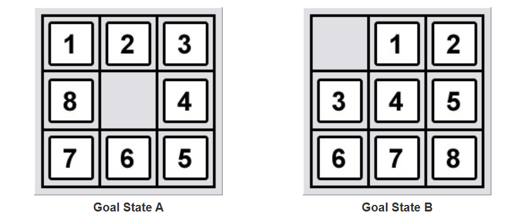
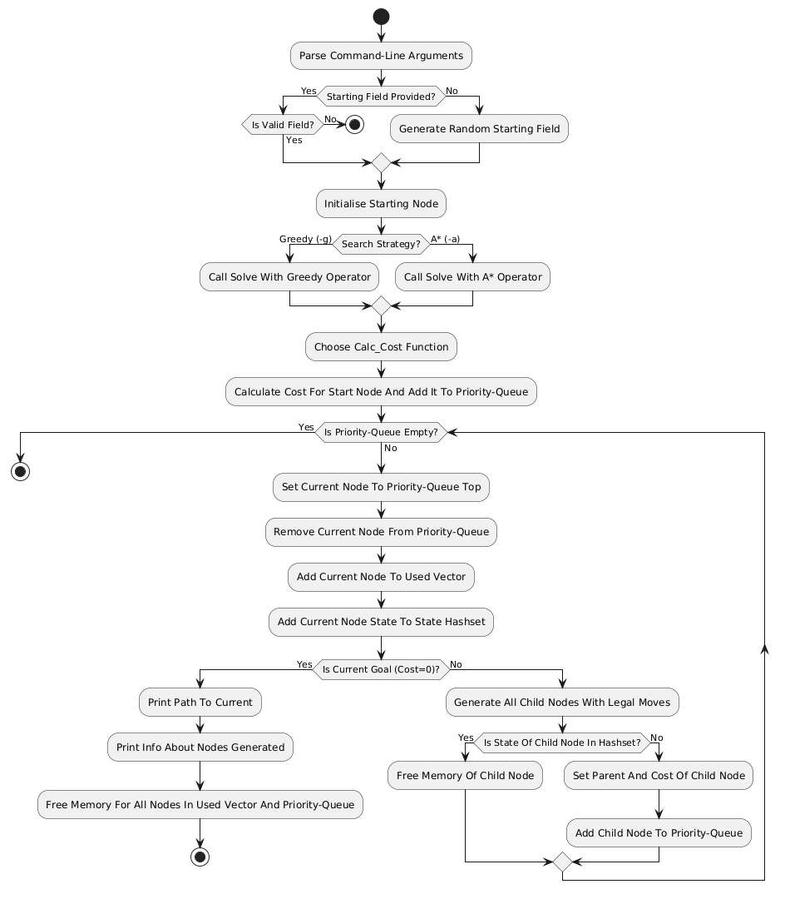

# 8-Puzzle: Ein Programm zum Lösen des 8-Puzzle-Problems
Dieses Programm wurde als Prüfungsleistung für meinen Kurs "Einführung in Artificial Intelligence" an der Leibniz-FH erstellt.
Es kann mithilfe der `CMakeLists.txt`-Datei gebaut werden, und mit `-h` oder `--help` wird eine Nutzungsanleitung ausgegeben.

Zum Parsen der Kommandozeilenargumente wird [CLI11](https://github.com/CLIUtils/CLI11?tab=readme-ov-file#license) verwendet.

## Spezifikation
Ich habe mich für die spezielle Definition des 8-Puzzle-Problems auf dieser [Seite](https://www.8puzzle.com/8_puzzle_problem.html) entschieden und verwende daher die folgenden Zielzustände:

# Fragen des Dozenten
1. **Wie ist ein Node modelliert?**

    Ein Node ist als Klasse modelliert. Dies ermöglicht es mir, wichtige Attribute wie den State (`fieldArray`), den Schrittzähler (`moveCount`) und die Kosten (`cost`) zu kapseln und über Methoden der Klasse zu ändern oder zu verwenden. Alle Attribute und Methodendeklarationen können in der `node.h`-Datei gefunden werden. Die dazugehörigen Implementierungen sind in der `node.cpp`-Datei zu finden.

2. **Wie werden die Successor Nodes erzeugt?**

    Die Routine zur Erzeugung von Successor Nodes ist in der `solver.h`-Datei in den Zeilen 109-136 zu finden. Um alle möglichen Successor Nodes zu erzeugen, wird über alle möglichen Zugrichtungen des leeren Feldes iteriert und geprüft, ob der Zug "legal" ist. Ist der Zug erlaubt, wird als Basis für die Successor Nodes die derzeit untersuchte Node kopiert.
    Der Zug wird ausgeführt und der resultierende State gegen ein Hash-Set der bereits gesehenen States geprüft. Ist der State im Hash-Set, wurde er bereits überprüft und die Node wird verworfen/der State übersprungen. Ist er nicht im Hash-Set, wird das Parent-Attribut der Successor Node gesetzt, die Kosten berechnet und die Node der  Priority-Queue hinzugefügt.

3. **Vergleich: Verwendung von A-Star vs. Greedy**

    Ich habe für beide Suchstrategien einen Komparator für die Priority-Queue geschrieben. Diese sind in der `solver.h`-Datei in den Zeilen 8–22 zu finden. Die verwendete Suchstrategie kann mit den Flags `-a` und `-g` der Kommandozeile ausgewählt werden. Wird keine der Flags verwendet, verwendet das Programm standardmäßig die A*-Suchstrategie.
    In meinen Tests ist die A* Suchstrategie im Durchschnitt schneller.

4. **Welche Heuristik verwenden Sie und wo kann dies im Code gefunden werden? (kurze Erklärung)**

    Ich verwende zur Berechnung der Kosten einer Node die Manhattan-Distanz, da diese Heuristik admisable ist.
    Diese Kostenberechnung ist für beide Zielzustände separat implementiert und kann in der `node.cpp`-Datei in den Zeilen 21–41 gefunden werden.
    Die Funktionen funktionieren im Kern gleich, verwenden aber verschiedene Zielzustände zur Berechnung. Zuerst wird die Indexdistanz eines Elements zu seiner Zielposition berechnet. Diese Indexdistanz wird dann durch drei geteilt und abgerundet, um die benötigten vertikalen Schritte des Elements zu seiner Zielposition zu berechnen. Um die benötigten horizontalen Schritte eines Elements zu seiner Zielposition zu erhalten, wird die Indexdistanz modulo 3 gerechnet. Diese beiden Werte, die horizontalen und vertikalen Schritte, werden addiert und ergeben die Kosten des einzelnen Elements.
    Um die Kosten des gesamten Feldes (der Node) zu erhalten, werden alle Elementkosten addiert, was durch eine For-Schleife realisiert wird.

5. **Wie ist Ihre Goal()-Funktion modelliert?**

    Meine `Goal()`-Funktion, die prüft, ob das Problem gelöst wurde, ist in der `solver.h`-Datei in den Zeilen 85-107 zu finden. Sie prüft, ob die derzeit untersuchte Node einen Zielzustand enthält (`cost == 0`). Ist dies der Fall, wurde eine Lösung für das 8-Puzzle-Problem gefunden. Wurde eine Lösung gefunden wird der Pfad zu der Lösung und Informationen zu den generierten Nodes ausgegeben, dannach wird der benutzte Speicher freigegeben und die `solve` Funktion endet. Es ist wichtig anzumerken, dass die derzeit untersuchte Node immer die günstigste ist, da sie aus dem Anfang der, nach Suchstrategie priorisierten, Priority-Queue genommen wird.
    Somit kann gewährleistet werden, dass z. B. A* immer die optimalste Lösung findet.

# Flowchart des Programms

  

